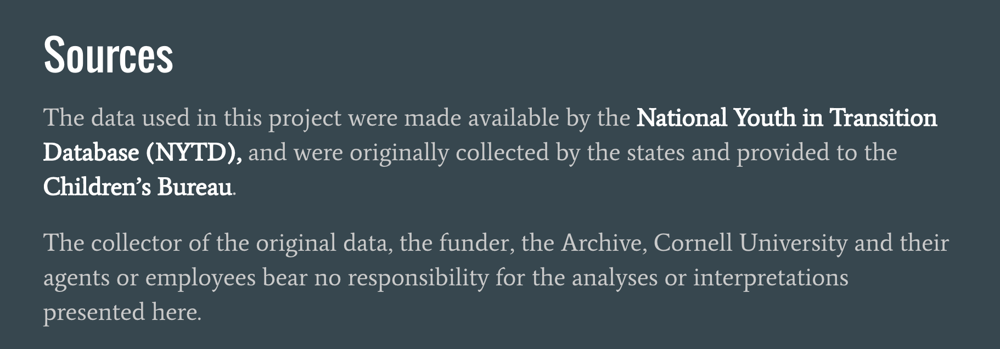

# Capstone Project Methodology
### Last Update: September 2016

## Project: Factors That Impact Educational Attainment Among Foster Youth

This repo folder contains the jupyter notebooks that document the steps and rationale for the project analysis. These notebooks contain the python code I used to complete my capstone project. For a high-level summary (an overview without code) of project background, aims, methodology, results and conclusions, please visit my capstone project blog post: https://kgracia44.github.io/capstone_post/

##### Raw Data Source:

**Note: In order to uphold confidentiality standards, no identifying data is ever displayed. 

## Approach and Table of Contents----------------------------- 

1) Data: Folder with 2 jupyter notebooks and data dictionary csv file
    
    - Jupyter Notebook 1: CleanData_MungeData_4Sets
    
    - In this notebook:
        
        - Raw data reviewed, described, and cleaned.
        - Data wrangled into 4 data sets for analysis and saved in local postgreSQL database and as CSV files.
        - 4 Data sets: Cohort 1 Baseline Population, Cohort 1 Baseline Pop excluding 7 states*, Cohort 1 Wave 2 Population, 
        and Cohort 2 Baseline Population
        
        * Please Note: In order to address data quality issue, data sets used for analysis exclude data from the following   
        states: HI, IN, KY, MS, OR, TX, TN.
____________________________________________________
    - Jupyter Notebook 2: DataDict_Risks_and_Assumps
    
    - In this notebook:
        
        - Data Dictionary (csv file is provided in this folder as well)
        - Risks and Assumptions of Data 
____________________________________________________    
    - Data Dictionary csv file

2) Exploratory Data Analysis (EDA)
    
    - Jupyter notebook: 
    
    - In this notebook:
        - Words